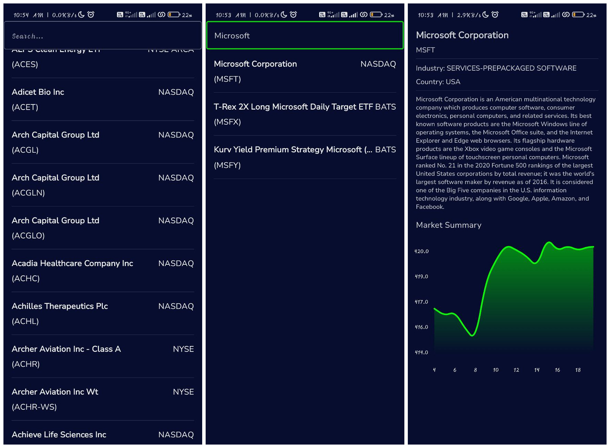

---
# StocksApp

Welcome to StocksApp, a clean and modular Android application for tracking stock market information. This app provides users with real-time data about various stocks, including intraday information and company listings.

## Features

- **Real-time Data**: Get up-to-date information about stocks, including intraday pricing and company details.
- **Clean Architecture**: Utilizes a clean architecture pattern, separating concerns into distinct layers for improved maintainability and scalability.
- **Modular Design**: Organized into separate modules for data, domain, presentation, and dependency injection, promoting code reusability and testability.
- **UI Customization**: Customize the user interface with themes and responsive components for an enhanced user experience.

## Usage

- Upon launching the app, users can explore  features such as viewing company listings and detailed information about specific stocks.
- Stay updated with real-time stock market data conveniently on your Android device.

---
**Clean Architecture**

**Data Layer:**
- **CSV:**
  - CSVParser
  - CompanyListingParser
  - IntradayInfoParser
- **Local:**
  - StockDao
  - StockDatabase
  - CompanyListingEntity.kt
- **Mapper:**
  - CompanyMapper.kt
  - IntradayInfoMapper.kt
- **Remote:**
  - **DTO:**
    - IntradayInfoDto
    - CompanyInfoDto
  - StockApi.kt
- **Repository:**
  - StockRepositoryImpl

**Domain Layer:**
- **Model:**
  - IntradayInfo
  - CompanyInfo
  - CompanyListing
- **Repository:**
  - StockRepository

**Presentation Layer:**
- **UI:**
  - **Theme:**
    - Color.kt
    - Shape.kt
    - Theme.kt
    - Type.kt
- **Company Info:**
  - **Composable:**
    - CompanyInfoScreen.kt
    - StockChart.kt
  - CompanyInfoState
  - CompanyInfoViewModel
- **Company Listings:**
  - **Composable:**
    - CompanyItem.kt
    - CompanyListingsScreen.kt
  - CompanyListingsState
  - CompanyListingsEvents
  - CompanyListingsViewModel

**DI Layer:**
- AppModule
- RepositoryModule

**Util Layer:**
- Resource

**Main Components:**
- MainActivity
- StockApplication
